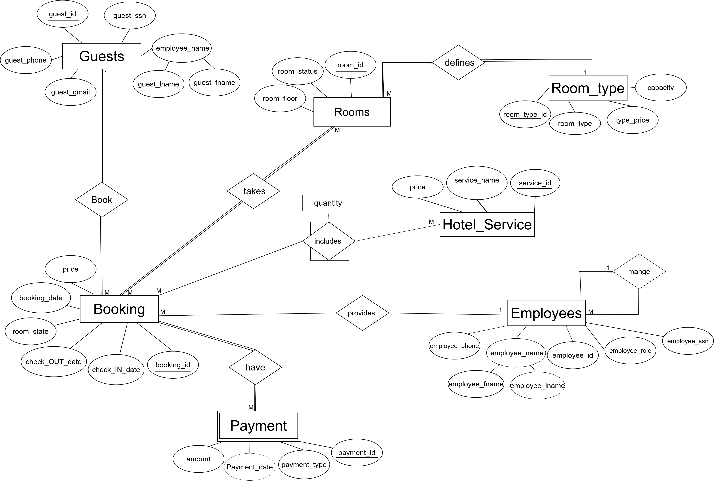

# 🏨 ROOM207 - Hotel Management System (Backend)


**ROOM207** is a database-driven project that demonstrates database design,
SQL queries execution, and frontend interaction.
It includes ER diagrams, mapping, SQL scripts, and a Jupyter notebook for database connection and testing.

## 🚀 Key Features
- 📊 Well-structured ER Diagram representing the database entities and relationships
- 🔄 ER to Relational Mapping following database design rules
- 🧾 Comprehensive Data Dictionary for tables and attributes
- 🛠️ SQL Queries for data retrieval and manipulation
- 🔐 Secure database connection using environment variables
- 🖥️ Simple frontend interface for interacting with the database
- 📁 Organized project structure for easy navigation and maintenance


## 🛠 Tech Stack
- **Database:** SQL Server  
- **Query Language:** SQL  
- **Backend / Connection:** Python (Jupyter Notebook)  
- **Frontend:** HTML  
- **Environment Management:** `.env` file  
- **Tools:** Git, GitHub  


## 📂 Project Structure

```bash
ROOM207/
│
├── ER_Diagram/              # Entity Relationship Diagram
├── Mapping/                 # ER to Relational Mapping
├── Queries/                 # SQL queries
│   ├── SQLQuery1.sql
│   ├── SQLQuery2.sql
│   └── SQLQuery3.sql
├── templates/               # HTML templates
│   └── Frontend.html
├── connection.ipynb         # Database connection & testing notebook
├── .env                     # Environment variables (local only)
└── .gitignore               # Files excluded from version control
```
## ER Diagram
The ER Diagram above illustrates the main entities of the ROOM207 system and their relationships. Each table, primary key, and foreign key is clearly represented.


## Mapping
The Relational Mapping diagram shows how the ER Diagram entities are converted into SQL tables, including table names, columns, and relationships between them.


